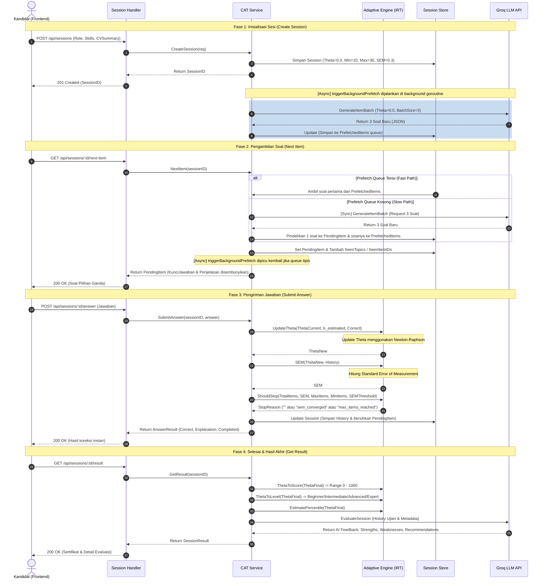

# Dokumentasi Alur Kode Computer Adaptive Testing (CAT) - Kredly

Dokumentasi ini menjelaskan arsitektur, alur logika, formula matematika, dan integrasi sistem **Computer Adaptive Testing (CAT)** pada backend Kredly. Sistem ini dirancang untuk menguji kompetensi teknis kandidat secara adaptif menggunakan model **Item Response Theory (IRT)** (Rasch / 1-PL Model) dengan bantuan **Groq LLM** untuk pembuatan soal secara dinamis.

---

## 1. Arsitektur & Komponen Utama

Sistem CAT Kredly terbagi ke dalam beberapa layer utama dalam Go backend:

```
+-------------------------------------------------------------+
|                     1. HTTP Handler Layer                   |
|           (server/internal/handlers/session.go)             |
|  - Menerima request HTTP dari frontend                      |
|  - Memvalidasi parameter & menyembunyikan data sensitif     |
+------------------------------+------------------------------+
                               |
                               v
+-------------------------------------------------------------+
|                     2. Service Core Layer                   |
|           (server/internal/service/cat_service.go)          |
|  - Orkestrator utama siklus hidup tes (Session)             |
|  - Manajemen background prefetching (Concurrency)           |
+-------------------+----------+-----------+------------------+
                    |          |           |
                    v          v           v
+-------------------+    +-----+-----+    +-------------------+
|  Adaptive Engine  |    |  Session  |    |    Groq Client    |
|   (irt.go,        |    |   Store   |    |    (generate.go,  |
|    topics.go)     |    | (store.go)|    |     evaluate.go)  |
| - Newton-Raphson  |    | - Memory  |    | - Generate soal  |
| - Hitung SEM      |    |   state   |    | - Evaluasi AI    |
| - Pemilihan Topik |    |   tracker |    |   (career path)  |
+-------------------+    +-----------+    +-------------------+
```

### Penjelasan Komponen:

- **`models.Session`**: Menyimpan state aktif ujian, termasuk nilai kemampuan kandidat saat ini ($\theta$ / Theta), riwayat jawaban, antrean soal yang di-prefetch, dan status selesai.
- **`store.SessionStore`**: Penyimpanan sesi ujian dalam memori (_in-memory_) yang dilengkapi mutex untuk keamanan konkurensi (_thread-safe_).
- **`service.CATService`**: Mengandung logika pembuatan sesi, pengambilan soal berikutnya, pemrosesan jawaban, penyesuaian kemampuan adaptif, dan evaluasi akhir.
- **`groq.Client`**: Berfungsi untuk melakukan API call ke Groq LLM untuk men-generate soal baru berdasarkan parameter kesulitan tertentu, serta memberikan analisis umpan balik karier di akhir sesi.

---

## 2. Siklus Hidup & Alur Kerja Ujian Adaptif

Proses CAT berjalan dalam 4 tahap utama: **Inisialisasi Sesi**, **Pengambilan Soal**, **Pengiriman Jawaban**, dan **Evaluasi Hasil Akhir**.

### A. Diagram Alur (Sequence & Logic Flow)

Berikut adalah visualisasi interaksi antarkomponen dari awal hingga akhir sesi tes:



---

## 3. Penjelasan Rinci Tiap Tahapan Kode

### 1. Inisialisasi Sesi (`CreateSession`)

Ketika kandidat memulai tes, frontend mengirim target peran (`role`), kemampuan opsional (`skills`), dan rangkuman CV (`cv_summary`).

- **Validasi Role**: Memastikan sistem mendukung atau memetakan peran ke kategori yang didukung (`backend engineer`, `frontend engineer`, dll).
- **Pembuatan State Sesi**: Menginisialisasi struct `Session` dengan parameter bawaan:
  - $\theta_{\text{awal}} = 0.0$ (kemampuan rata-rata).
  - `MinItems` = 10 (jumlah soal minimal sebelum boleh berhenti secara konvergen).
  - `MaxItems` = 30 (batas soal maksimal agar tes tidak berlangsung selamanya).
  - `SEMThreshold` = 0.3 (target akurasi statistik).
- **Asynchronous Prefetching**: Untuk menghindari latensi LLM yang lambat (3-6 detik per call), sistem langsung menembak goroutine `triggerBackgroundPrefetch()` untuk menyiapkan batch soal pertama berisi **3 pertanyaan** di latar belakang.

---

### 2. Pengambilan Soal (`NextItem`)

Ketika kandidat meminta soal baru, sistem menggunakan pendekatan optimasi jalur cepat dan lambat:

- **Jalur Cepat (Prefetch Queue)**: Jika antrean `PrefetchedItems` memiliki soal, sistem langsung mengambil soal teratas, memindahkannya ke `PendingItem`, memasukkannya ke daftar `SeenItemIDs` dan `SeenTopics`, lalu mengembalikannya ke kandidat.
- **Jalur Lambat (Synchronous Generation)**: Jika antrean kosong (misalnya karena koneksi lambat atau prefetch sebelumnya gagal), sistem memanggil `GenerateItemBatch` secara sinkronus untuk menghasilkan 3 soal baru dari Groq, memberikan 1 ke kandidat, dan menyimpan 2 sisanya di antrean.
- **Refill Queue**: Setiap kali soal diambil dari antrean, jika antrean sisa `< 3`, sistem memicu background prefetch kembali secara _asynchronous_ untuk mengisi ulang antrean.
- **Masking Informasi Sensitif**: Di tingkat HTTP Handler (`HandleNextItem`), properti `KunciJawaban`, `Penjelasan`, dan tingkat kesulitan soal asli (`BEstimated`) disembunyikan menggunakan struct `FilteredItem` agar kandidat tidak bisa melakukan _cheat_ melalui inspeksi network browser.

---

### 3. Pengiriman Jawaban (`SubmitAnswer`)

Kandidat mengirimkan pilihan jawaban mereka ('A', 'B', 'C', atau 'D').

- **Koreksi**: Sistem membandingkan jawaban dengan kunci secara _case-insensitive_.
- **Pembaruan Nilai Kemampuan ($\theta$)**: Menggunakan metode iteratif **Newton-Raphson** pada fungsi IRT 1-Parameter Logistic (Rasch Model) (lihat bagian matematika di bawah).
- **Penyimpanan Riwayat**: Menyimpan riwayat soal ke dalam array `History` yang berisi: `ItemID`, `Topic`, `Answer`, `Correct`, `ThetaAfter`, dan `BParam` (tingkat kesulitan soal).
- **Standard Error of Measurement (SEM)**: Mengukur ketidakpastian/kesalahan estimasi kemampuan saat ini. Semakin banyak soal terjawab dengan konsisten, semakin kecil nilai SEM.
- **Kondisi Berhenti (`ShouldStop`)**:
  - Ujian dihentikan dengan alasan **`max_items_reached`** jika jumlah soal sudah mencapai batas maksimum (30 soal).
  - Ujian dihentikan dengan alasan **`sem_converged`** jika jumlah soal sudah memenuhi batas minimum (10 soal) **DAN** nilai SEM saat ini sudah kurang dari atau sama dengan `0.3`.
- **Pemasangan Status**: State `PendingItem` dikosongkan kembali agar kandidat tidak bisa mengirimkan jawaban ganda untuk soal yang sama.

---

### 4. Hasil Akhir & Evaluasi AI (`GetResult`)

Setelah status sesi diubah menjadi selesai (`Completed = true`), kandidat dapat meminta ringkasan hasil tes.

- **Skala Nilai**:
  - Mengubah nilai $\theta$ dari range $[-4.0, +4.0]$ ke format skor tradisional $0 - 1000$.
  - Menentukan predikat Senioritas:
    - $\theta < -1.0$: **Beginner**
    - $-1.0 \le \theta < 0.5$: **Intermediate**
    - $0.5 \le \theta < 1.5$: **Advanced**
    - $\theta \ge 1.5$: **Expert**
- **Analisis AI Karier (Groq)**: Seluruh riwayat topik dan hasil kebenaran jawaban dikirim ke Groq LLM untuk dianalisis guna menghasilkan:
  - **Feedback**: Ulasan performa secara keseluruhan.
  - **Strengths & Weaknesses**: Penjabaran topik spesifik apa yang dikuasai dan kurang dikuasai.
  - **Recommendations**: Langkah nyata/sumber materi untuk meningkatkan kemampuan kandidat.
- **Fallback Mechanism**: Jika API Groq mati atau mengalami timeout saat evaluasi, sistem memiliki respons fallback statis agar kandidat tetap bisa melihat skor dan level mereka tanpa mengalami error 500.

---

## 4. Dasar Matematika: Item Response Theory (IRT)

Modul `server/internal/service/irt.go` mengimplementasikan kalkulasi statistik adaptif dengan persamaan berikut:

### A. Probabilitas Menjawab Benar (Rasch / 1-PL Model)

Probabilitas $P_i(\theta)$ seorang kandidat dengan kemampuan $\theta$ menjawab soal $i$ dengan kesulitan $b_i$ secara benar adalah:

$$P_i(\theta) = \frac{1}{1 + e^{-(\theta - b_i)}}$$

Di mana:

- $\theta$ (Theta) = Kemampuan kandidat (berkisar antara $-4.0$ hingga $+4.0$).
- $b_i$ (b-parameter) = Tingkat kesulitan soal (berkisar antara $-4.0$ hingga $+4.0$).

### B. Pembaruan Kemampuan: Metode Newton-Raphson

Setiap setelah soal dijawab, nilai $\theta$ diperbarui secara iteratif dengan rumus:

$$\theta_{\text{baru}} = \theta_{\text{lama}} + \Delta\theta$$

$$\Delta\theta = \frac{U_i - P_i(\theta_{\text{lama}})}{P_i(\theta_{\text{lama}}) \cdot (1 - P_i(\theta_{\text{lama}}))}$$

Di mana:

- $U_i$ = Hasil jawaban ($1.0$ jika benar, $0.0$ jika salah).
- $P_i(\theta_{\text{lama}})$ = Probabilitas menjawab benar berdasarkan tingkat kemampuan lama.
- Sistem membatasi nilai langkah maks per soal ($|\Delta\theta| \le 1.5$) untuk menghindari osilasi nilai ekstrem atau perubahan radikal akibat satu kali tebakan beruntung/salah.
- Nilai akhir $\theta$ selalu di-_clamp_ dalam rentang $[-4.0, +4.0]$.

### C. Standard Error of Measurement (SEM)

SEM merepresentasikan tingkat ketidakpastian estimasi kemampuan $\theta$. Formulanya adalah kebalikan dari akar total Informasi Tes (Test Information Function):

$$SEM(\theta) = \frac{1}{\sqrt{I(\theta)}} = \frac{1}{\sqrt{\sum_{j=1}^{n} P_j(\theta) \cdot (1 - P_j(\theta))}}$$

Di mana:

- $n$ adalah jumlah soal yang sudah dikerjakan kandidat sejauh ini.
- Semakin banyak soal yang dijawab, penyebut (Total Informasi) akan bertambah besar, sehingga nilai SEM akan terus menyusut. Jika SEM mencapai $\le 0.3$, tes dianggap telah mengukur kemampuan kandidat dengan tingkat akurasi yang memuaskan dan dihentikan lebih awal.

---

## 5. Ringkasan Endpoint API CAT

Berikut adalah rute API yang diekspos oleh Gin Router (`server/cmd/api/main.go`):

| Method   | Endpoint                      | Deskripsi                           | Input JSON                                              | Output JSON                                                                                                                                                                  |
| :------- | :---------------------------- | :---------------------------------- | :------------------------------------------------------ | :--------------------------------------------------------------------------------------------------------------------------------------------------------------------------- |
| **POST** | `/api/sessions`               | Membuat sesi tes baru               | `{"role": "...", "skills": [...], "cv_summary": "..."}` | `{"session_id": "...", "role": "...", "level": "...", "theta_init": 0}`                                                                                                      |
| **GET**  | `/api/sessions/:id/next-item` | Mengambil soal berikutnya           | _None_                                                  | `{"item": {"id": "...", "topic": "...", "pertanyaan": "...", "pilihan": [...]}, "question_number": 1}`                                                                       |
| **POST** | `/api/sessions/:id/answer`    | Mengirimkan jawaban kandidat        | `{"answer": "A"}`                                       | `{"correct": true, "correct_answer": "A", "explanation": "...", "theta_new": 0.5, "completed": false}`                                                                       |
| **GET**  | `/api/sessions/:id/result`    | Mengambil hasil akhir & evaluasi AI | _None_                                                  | `{"score": 560, "theta": 0.5, "level": "Intermediate", "feedback": "...", "strengths": [...], "weaknesses": [...], "recommendations": [...], "verification_id": "CERT-..."}` |
